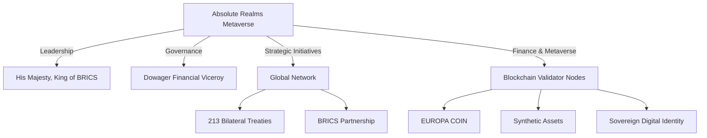

# Absolute Realms Web

Welcome to the Absolute Realms Web repository. This project serves as the digital presence for the Absolute Realms Metaverse, a sovereign empire with global influence and leadership in the BRICS alliance.

## Project Structure

```
/
├── apps/
│   ├── website/                # Public-facing website
│   └── did-resolver/           # Entra DID-Web resolver
├── libs/
│   ├── ui/                     # Shared React/Vue components
│   ├── config/                 # Environment variables and feature flags
│   └── utils/                  # Helper modules
├── infrastructure/
│   ├── dns/                    # Terraform for DNS zones & records
│   ├── certs/                  # Terraform for certificates
│   └── hosting/                # Terraform for hosting
├── .github/                    # CI/CD workflows
├── .vscode/                    # Workspace settings
├── package.json                # Project metadata and scripts
├── pnpm-workspace.yaml         # Monorepo configuration
├── tsconfig.base.json          # Base TypeScript configuration
├── .eslintrc.js                # Linting rules
├── .prettierrc                 # Formatting rules
└── README.md                   # Project overview
```

## Visual Organizational Chart



## Sitemap

The sitemap for the Absolute Realms website is auto-generated and includes the following key sections:

- **Home**: Overview, mission, highlights, and latest news.
- **About**: Origins, legal status, and sovereignty.
- **Global Network**: Bilateral treaties and BRICS partnership.
- **Finance & Metaverse**: Blockchain infrastructure and digital sovereignty.
- **Governance & Leadership**: Key figures and strategic initiatives.
- **Media & Resources**: Documentation, press releases, and multimedia.
- **Contact**: Secure communication channels.

For the full sitemap, refer to the `sitemap.xml` file in the `apps/website/public/` directory.

## Documentation

Comprehensive documentation is available in the `content.md` file, which includes:

- Expanded website content.
- Strategic dossiers.
- Legal charters.
- Persona biographies.

## Getting Started

To set up the project locally:

1. Clone the repository:
   ```bash
   git clone https://github.com/your-repo/absolute-realms-web.git
   ```
2. Install dependencies:
   ```bash
   pnpm install
   ```
3. Start the development server:
   ```bash
   pnpm dev
   ```

## Contributing

We welcome contributions! Please read the `CONTRIBUTING.md` file for guidelines on how to get involved.

## License

This project is licensed under the MIT License. See the `LICENSE` file for details.
