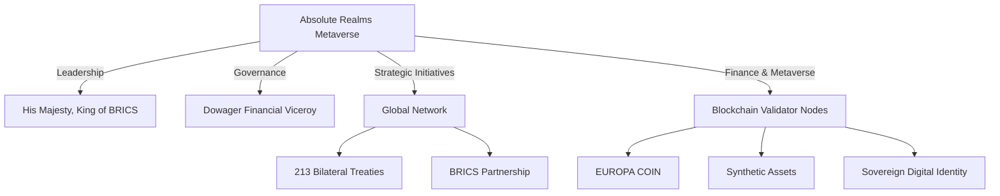

# Absolute Realms Web

Welcome to the Absolute Realms Web repository. This project serves as the digital presence for the Absolute Realms Metaverse, a sovereign empire with global influence and leadership in the BRICS alliance.

## Project Structure

```
/
├── apps/
│   ├── website/                # Public-facing website
│   └── did-resolver/           # Entra DID-Web resolver
├── libs/
│   ├── ui/                     # Shared React/Vue components
│   ├── config/                 # Environment variables and feature flags
│   └── utils/                  # Helper modules
├── infrastructure/
│   ├── dns/                    # Terraform for DNS zones & records
│   ├── certs/                  # Terraform for certificates
│   └── hosting/                # Terraform for hosting
├── .github/                    # CI/CD workflows
├── .vscode/                    # Workspace settings
├── package.json                # Project metadata and scripts
├── pnpm-workspace.yaml         # Monorepo configuration
├── tsconfig.base.json          # Base TypeScript configuration
├── .eslintrc.js                # Linting rules
├── .prettierrc                 # Formatting rules
└── README.md                   # Project overview
```

## Visual Organizational Chart



## Sitemap

The sitemap for the Absolute Realms website is auto-generated and includes the following key sections:

- **Home**: Overview, mission, highlights, and latest news.
- **About**: Origins, legal status, and sovereignty.
- **Global Network**: Bilateral treaties and BRICS partnership.
- **Finance & Metaverse**: Blockchain infrastructure and digital sovereignty.
- **Governance & Leadership**: Key figures and strategic initiatives.
- **Media & Resources**: Documentation, press releases, and multimedia.
- **Contact**: Secure communication channels.

For the full sitemap, refer to the `sitemap.xml` file in the `apps/website/public/` directory.

## Documentation

Comprehensive documentation is available in the `content.md` file, which includes:

- Expanded website content.
- Strategic dossiers.
- Legal charters.
- Persona biographies.

## Feature Overview

Absolute Realms Web provides:

- Automated Azure VM inventory, quota, and pricing reports
- Best-value VM recommendations and architecture generation
- CI/CD workflows for full automation and scheduled reporting
- Modular, extensible content and infrastructure

## Automated Reports & CI/CD

The `.github/workflows/vm-report-automation.yml` workflow automates:

- Running the VM quota and pricing scripts
- Generating summary reports and Bicep deployment templates
- Uploading all results as build artifacts

Artifacts include:

- `vm-sizes-quotas.csv` — VM size/region/quota data
- `vm-sizes-quotas-pricing.csv` — Data joined with up-to-date Azure pricing
- `summary.txt` — Automated summary and recommendations
- `best-value-vm.bicep` — Bicep template for best-value VM deployment

## Advanced Recommendations

The reporting pipeline analyzes all available VM sizes and regions, pricing, and quotas to recommend:

- The best-value VM (lowest price per vCPU)
- Regions with optimal availability and cost
- Automated Bicep templates for rapid deployment

You can further expand recommendations by editing the scripts in `scripts/`.

## Extending & Customizing

- To add new website sections, update `content.md` and the website source in `apps/website/`.
- To add new automation or reports, add scripts to `scripts/` and update the GitHub Actions workflow.
- For new personas, style guides, or press releases, see the prompts at the end of `content.md`.

## Links to Key Content

- [Expanded Website Content](content.md)
- [Sitemap XML](apps/website/public/sitemap.xml)
- [Persona Biographies, Style Guide, and Press Releases](content.md)

## Using the Scripts

### VM Summary Report

Run the `vm-summary-report-advanced.py` script to generate advanced analytics and recommendations:

```bash
python3 scripts/vm-summary-report-advanced.py <input-csv>
```

### Bicep Template Generation

Generate a Bicep template for deploying a recommended VM size:

```bash
python3 scripts/vm-arch-bicepgen.py <input-csv> <output-bicep>
```

### Quota CSV Script

Run the `vm-quota-csv.sh` script to gather VM quota data:

```bash
bash scripts/vm-quota-csv.sh --regions "eastus,westus" --output "output.csv"
```

## Getting Started

To set up the project locally:

1. Clone the repository:

   ```bash
   git clone https://github.com/your-repo/absolute-realms-web.git
   ```

2. Install dependencies:

   ```bash
   pnpm install
   ```

3. Start the development server:

   ```bash
   pnpm dev
   ```

## Contributing

We welcome contributions! Please read the `CONTRIBUTING.md` file for guidelines on how to get involved.

## License

This project is licensed under the MIT License. See the `LICENSE` file for details.
